# Logging with Datadog Log Management

Welcome to Logging with Datadog Log Management workshop.
This repository contains a "dummy" Water System microservices project, a single page web application with microservices, already instrumented and analyzed using Datadog's APM and infrastructure products.


This workshop shows you how log management can reduce your mean time to resolution should you encounter an issue with a given application by giving you the best setup practice and a global tour of Datadog Log Management solution.

You have a few requirements to use this workshop, refer to the setup instruction <a href="https://github.com/l0k0ms/log-workshop-2#before-the-workshop--prerequisites" target="_blank">in the main README.md file</a> to configure your environment.

<a href="http://www.twitter.com/burningion" target="_blank">Kirk Kaiser</a> has worked hard to make this workshop as helpful possible, but if you see something that could be improved, please feel free to create a <a href="https://github.com/burningion/distributed-tracing-with-apm-workshop" target="_blank">Github issue</a> on the repository, or reach out via the <a href="https://chat.datadoghq.com/" target="_blank">Datadog public slack</a>.

# Getting Started 

If you already followed the workshop setup instructions, you can directly jump to step 5.

1. If not done already, the first thing to do is to create a <a href="https://www.datadoghq.com" target="_blank">Datadog account</a>.

2. Then clone this repository on your local machine: ```git clone https://github.com/l0k0ms/log-workshop-2.git```

3. Launch the application using the `<DD_API_KEY>` <a href="https://app.datadoghq.com/account/settings#api" target="_blank">from your trial account</a>.
    Your command should look like the following on MacOS/Linux:
    ```bash
    POSTGRES_USER=postgres POSTGRES_PASSWORD=123456 DD_API_KEY=<DD_API_KEY> docker-compose up --build
    ```
    For Windows, the process of setting environment variables is a bit different:
    ```
    PS C:\dev> $env:POSTGRES_USER=postgres
    PS C:\dev> $env:POSTGRES_PASSWORD=123456
    PS C:\dev> $env:DD_API_KEY=<DD_API_KEY>
    PS C:\dev> docker-compose up --build
    ```
    
4. After running the above command and seeing the logs flowing in your terminal go to <a href="http://localhost:5000/" target="_blank">http://localhost:5000/</a> and see the single page web app.
    Refresh the page, click around, add a pump, try adding a city. This begins to generate metrics, APM traces, and logs for your application.
    
5. Go to Datadog, to see your application corresponding data:
    * In the <a href="https://app.datadoghq.com/process" target="_blank">live processes view</a>
    * In the <a href="https://app.datadoghq.com/containers" target="_blank">containers view</a>
    * In the <a href="https://app.datadoghq.com/apm/services" target="_blank">APM Services view</a>
    * In the <a href="https://app.datadoghq.com/service/map?env=workshop" target="_blank">APM Services Map view</a>
    * In the <a href="https://app.datadoghq.com/infrastructure/map?fillby=avg%3Aprocess.stat.container.io.wbps&sizeby=avg%3Anometric&groupby=short_image&nameby=name&nometrichosts=false&tvMode=false&nogrouphosts=true&palette=YlOrRd&paletteflip=false&node_type=container" target="_blank">container map view</a>

Tab back over to your terminal, and look over the container logs, go to your <a href="Datadog log management page" target="_blank">https://app.datadoghq.com/logs</a> and notice that there is no log yet... 

Our first mission should you choose to accept it, configure the Datadog Agent to start forwarding your logs into your Datadog Application.

# Gathering our first logs

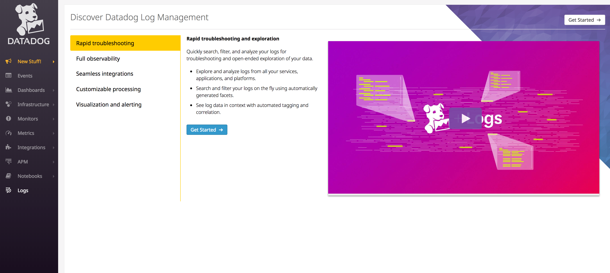

There is no log yet in your <a href="https://app.datadoghq.com/logs" target="_blank">Log Explorer page</a>, because the Datadog Agent is not configured to gather them, to change this let's follow those steps:

1. Add the following configuration lines in your `docker-compose.yml` file at the root of the workshop directory:
    ```
    datadog:
      environment:
        (...)
        - DD_LOGS_ENABLED=true
        - DD_LOGS_CONFIG_CONTAINER_COLLECT_ALL=true
      volume:
        (...)
        - /opt/datadog-agent/run:/opt/datadog-agent/run:rw
    ```
| Configuration                                      | type         | Explanations                                    |
| :----                                              | :-----       | :-----                                          |
| `DD_LOGS_ENABLED=true`                             | env variable | Enable log collection                           |
| `DD_LOGS_CONFIG_CONTAINER_COLLECT_ALL=true`        | env variable | Enable log collection for all containers        |
| `/opt/datadog-agent/run:/opt/datadog-agent/run:rw` | volume       | Used to store pointers on container current log |
<a href="https://docs.datadoghq.com/logs/log_collection/docker/" target="_blank">Refer to the Datadog Agent log collection documentation to learn more</a>. 
2. Then restart your application:
    * Run `docker-compose stop && docker-compose rm`
    * Run `POSTGRES_USER=postgres POSTGRES_PASSWORD=123456 DD_API_KEY=<DD_API_KEY> docker-compose up --build`
    
    *Note*: On some OS you might see this error popping:
    ```
    ERROR: for agent  Cannot start service agent: b'Mounts denied: \r\nThe path /opt/datadog-agent/run\r\nis not shared ...
    ```
    To fix it either give the mount permission to this folder on your machine, or remove `
    /opt/datadog-agent/run:/opt/datadog-agent/run:rw` from the `docker-compose.yml` file.

3. Finally, go to your Datadog application in <a href="https://app.datadoghq.com/logs/" target="_blank">`Log -> Explorer`</a> and check your logs flowing.


# Using Label to correctly tag logs

As you can notice in the previous screenshot, all logs are currently showing up in the Datadog Log explorer view with the same service name `docker` -which is technically true- but in order to gain more visibility about which container emited which logs and in order to bind your logs with the previously implemented APM and metrics, let's use Labels to specify the `source` and the `service` tags for each container logs. 

* **The `source` tag is key to enable the integration pipeline**

    Datadog has a range of [Log supported integrations](https://docs.datadoghq.com/integrations/#cat-log-collection). In order to enable the [Log integrations pipeline](https://docs.datadoghq.com/logs/processing/pipelines/) in Datadog, pass the `source` name as a value for the source attribute with a docker label.

* **The `service` tag is key for binding metrics traces and logs.**

    The application is already instrumented for APM. Let's add the `service` tags to the `iot-frontend`, `noder`, `pumps`, `redis`, `sensor`, `db` and `adminer` containers in order to be able to bind their traces and their logs together.

Update your `docker-compose.yml` file at the root directory of the workshop with the following labels:

```
version: '3'
services:
  agent:
    (...)
    labels:
      com.datadoghq.ad.logs: '[{"source": "docker", "service": "agent"}]'

  frontend:
    (...)
    labels:
      com.datadoghq.ad.logs: '[{"source": "iot-frontend", "service": "iot-frontend"}]'

  noder:
    (...)
    labels:
      com.datadoghq.ad.logs: '[{"source": "noder", "service": "noder"}]'
      
  pumps:
    (...)
    labels:
      com.datadoghq.ad.logs: '[{"source": "pumps-service", "service": "pumps-service"}]'

  redis:
    (...)
    labels:
      com.datadoghq.ad.logs: '[{"source": "redis", "service": "redis"}]'
      
  sensors:
    (...)
    labels:
      com.datadoghq.ad.logs: '[{"source": "sensors", "service": "sensors-api"}]'

  db:
    (...)
    labels:
      com.datadoghq.ad.logs: '[{"source": "postgresql", "service": "postgres"}]'

  adminer:
    (...)
    labels:
      com.datadoghq.ad.logs: '[{"source": "adminer", "service": "adminer"}]'
```

Then restart your application:

1. Run `docker-compose stop && docker-compose rm`
2. Run `POSTGRES_USER=postgres POSTGRES_PASSWORD=123456 DD_API_KEY=<DD_API_KEY> docker-compose up`

And go to <a href="http://localhost:5000/" target="_blank">http://localhost:5000/</a> to generate some actions. 

Finally go to your Log explorer view to see the new `service` tags flowing in:


### Switching between Traces and Logs

The `service` tag now allows us to switch between our log explorer view and the corresponding APM service:

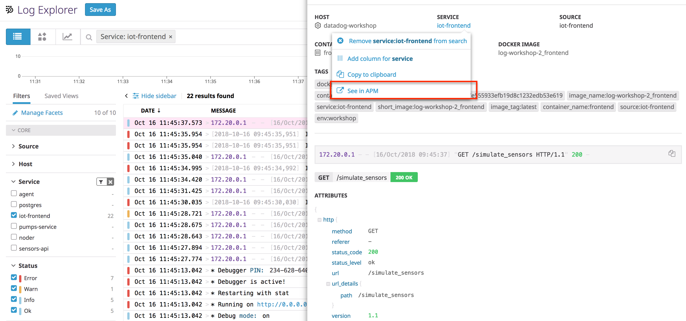

1. Open a log from `iot-frontend` by clicking on it.

2. On top of the contextual panel click on the `iot-frontend` Service name.

3. You should arrive on this page in Datadog APM:


4. Open the `simulate_sensor` ressource and then any given trace, when switching to the log tab you should see the corresponding logs:
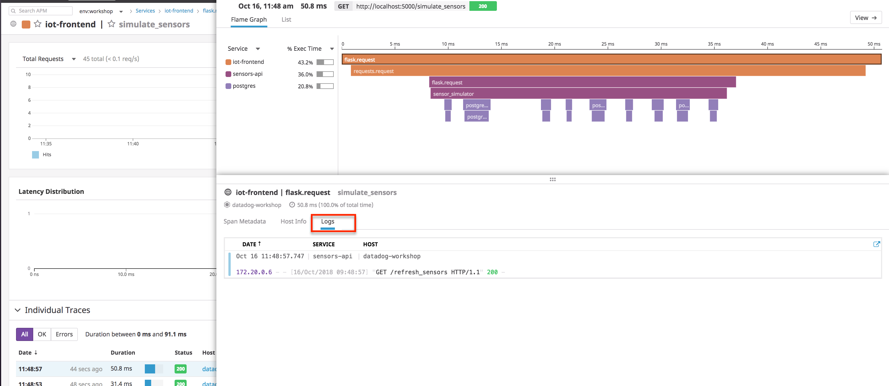

5. Click on the log to get back to the log explorer view.

### Switching between Metrics and Logs

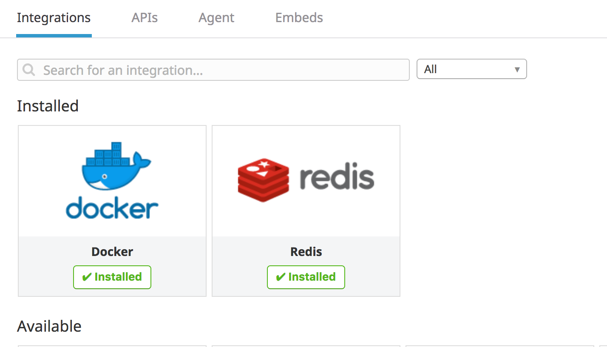

Since our containers are correctly labeled, install the <a href="https://app.datadoghq.com/account/settings#integrations/docker" target="_blank">Datadog-Docker integration</a> and <a href="https://app.datadoghq.com/account/settings#integrations/redis" target="_blank">Datadog-Redis integration</a> to benefit from out of the box Dashboard:

* <a href="https://app.datadoghq.com/screen/integration/52/docker---overview" target="_blank">Docker Dashboard</a>
* <a href="https://app.datadoghq.com/screen/integration/15/redis---overview" target="_blank">Redis Dashboard</a>

On a any given dashboard you can click on a displayed metric to switch to the corresponding logs:

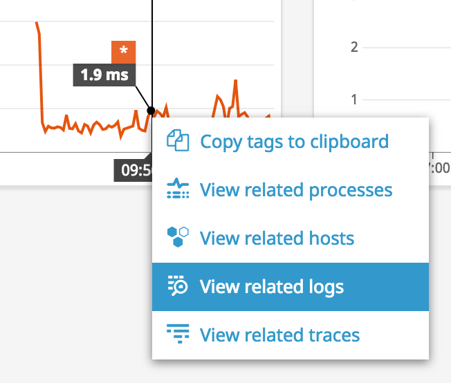

# Logging without limit

Now that our logs are correctly labeled we are able to manipulate them during their processing in Datadog.

Let's go to the <a href="https://app.datadoghq.com/logs/pipelines" target="_blank">Pipeline page</a> of Datadog and see what we have:

The `source` tag already enabled the `Docker` and `Redis` integration pipeline

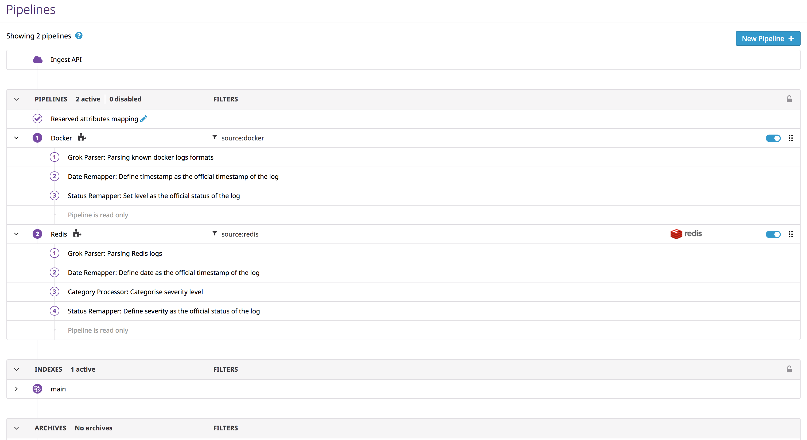

Which now automatically parse Docker Agent logs and Redis logs:


### Exclustion filter 

Let's set up the following Index filters:

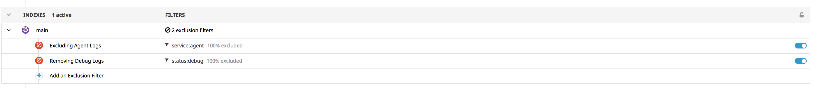

#### Removing Agent log

In order to clean our log explorer from logs that are not relevant for our usecase let's implement an <a href="https://docs.datadoghq.com/logs/logging_without_limits/#exclusion-filters" target="_blank">index filter</a>. :


Learn more about [Logging without limits](https://docs.datadoghq.com/logs/logging_without_limits/).


#### Removing Debug log

As a general best practice we also advise you to add an index filter on your Debug logs:


Our log explorer view now only contains logs from our containers and no more from the Datadog Agent all logs matching the following query: `service:agent` are no longer reporting: 


# Live tail 

Now that we filtered out our Agent logs and all our Debug logs, our explorer view is cleaner but we might still want to consult those logs. 

It's still possible with the [Live tail page](https://app.datadoghq.com/logs/livetail) of Datadog.

The live tail page displays all logs after the Pipeline section but before the index filter one. If you enter the following query: `service:agent` you are able to see the parsed agent log even if they won't be indexed:


# Parsing a full text log into JSON

Most of the time all your logs won't be in JSON format, and if they are their attributes my differ between two log sources.

Let's take the following log emited by the `iot-frontend` service:

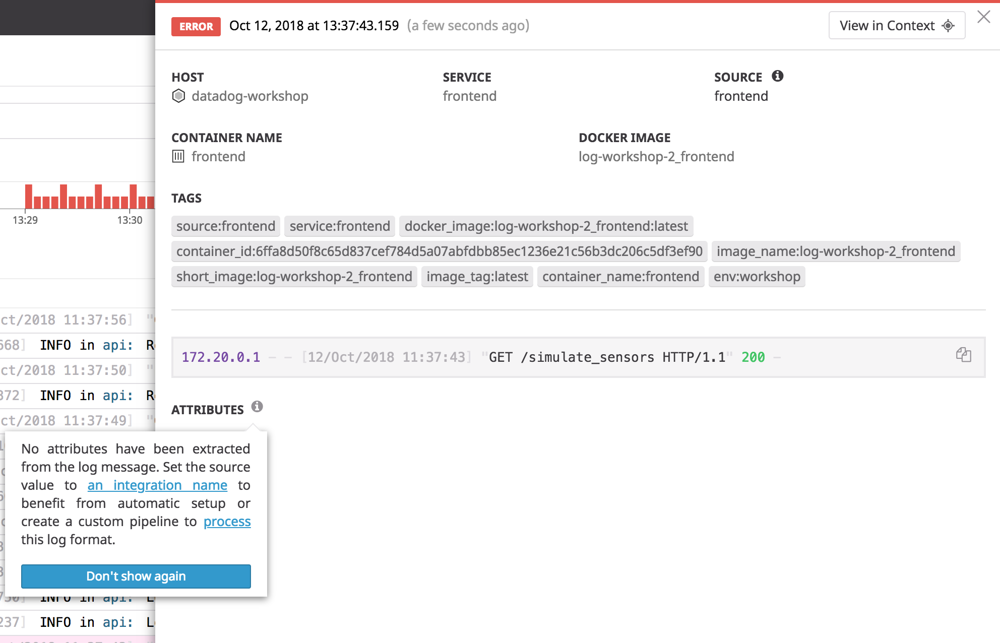

```
172.20.0.1 - - [12/Oct/2018 11:37:43] "GET /simulate_sensors HTTP/1.1" 200 -
```

And let's transform it to extract the IP adresse, the date, the method, the url, the scheem, and the status code: 
For this we are going to follow the [Datadog Attribute Naming convention](https://docs.datadoghq.com/logs/processing/attributes_naming_convention/).

Let's start to go to the pipeline section again and create a new pipeline:

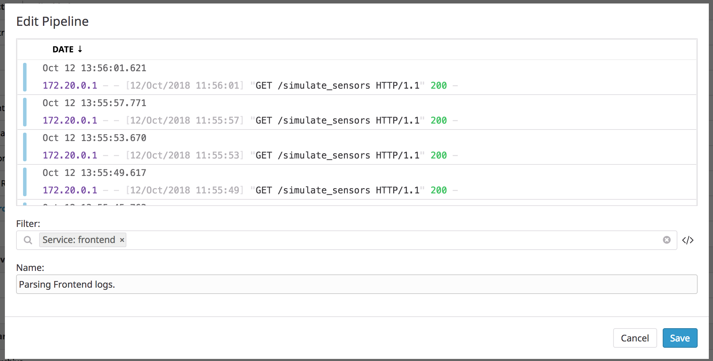

**Note**: As a best practice it's recommended to set a filter for your pipeline in order to ensure that only logs matching a specific request will enter it.

### Grok parser

Create a *Grok parser* processor to parse your full text logs and transform it into a JSON.


The full grok rule is:
```
rule %{ip:network.client_ip} - - \[%{date("dd/MMM/yyyy HH:mm:ss")}\] "%{word:http.method} %{notSpace:http.url} HTTP\/%{number:http.version}" %{number:http.status_code} %{notSpace:http.referer}
```


| Text                     | Pattern                               |
| ---                      | ----                                  |
| `172.20.0.1`             | `%{ip:network.client_ip}`             |
| `[12/Oct/2018 11:44:58]` | `\[%{date("dd/MMM/yyyy HH:mm:ss")}\]` |
| `GET`                    | `%{word:http.method}`                 |
| `/simulate_sensors`      | `%{notSpace:http.url}`                |
| `HTTP/1.1`               | `HTTP\/%{number:http.version}`        |
| `200`                    | `%{number:http.status_code}`          |
| `-`                      | `%{notSpace:http.referer}`            |

### Category processor

An access log by definition doesn't have any status attached, but there is a way to assign your log a status depending of the value of the `http.status_code` attribute. For this create a category processor:

And add 4 category to it:

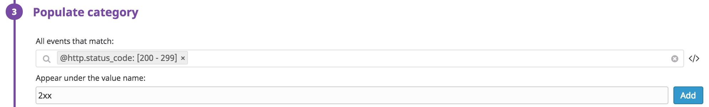

| All events that match:           | Appear under the value name: |
| ----                             | ---                          |
| `@http.status_code:[200 TO 299]` | ok                           |
| `@http.status_code:[300 TO 399]` | notice                       |
| `@http.status_code:[400 TO 499]` | warning                      |
| `@http.status_code:[500 TO 599]` | error                        |


### Status remapper

Create a status remapper processor to take the category we just created and remap it as your official log status:

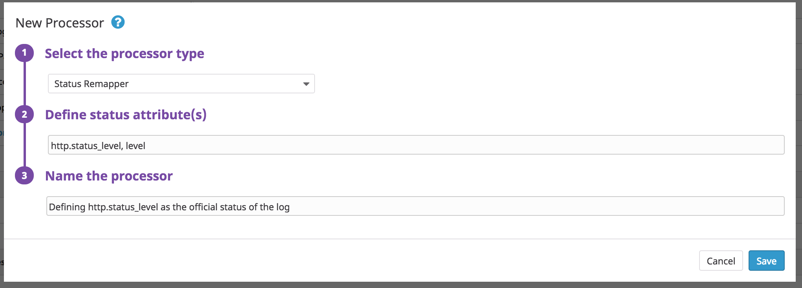

### Url Parser

Finally create an url parser to extract all query params from your requested URL:

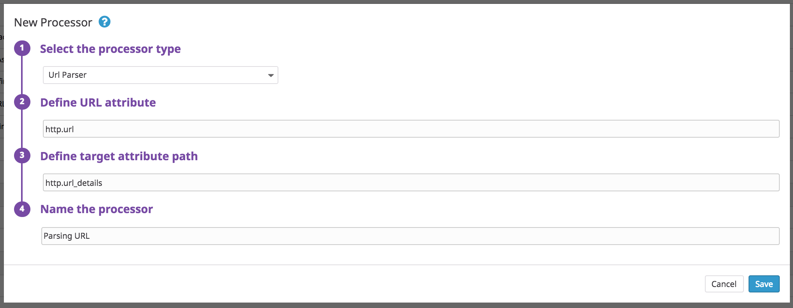

### Final Log

Now all your `iot-frontend` service logs are correctly parsed:

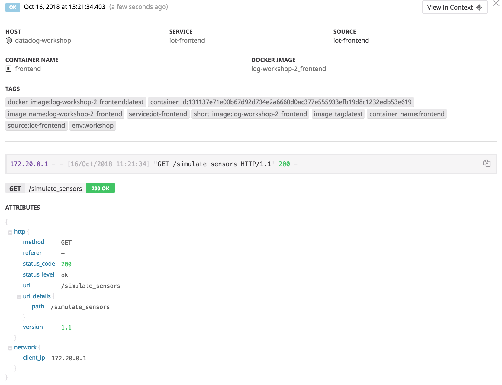

# Adding attribute as a Facet

To add an attribute as a Facet and start using it in your log analytics, click on it:

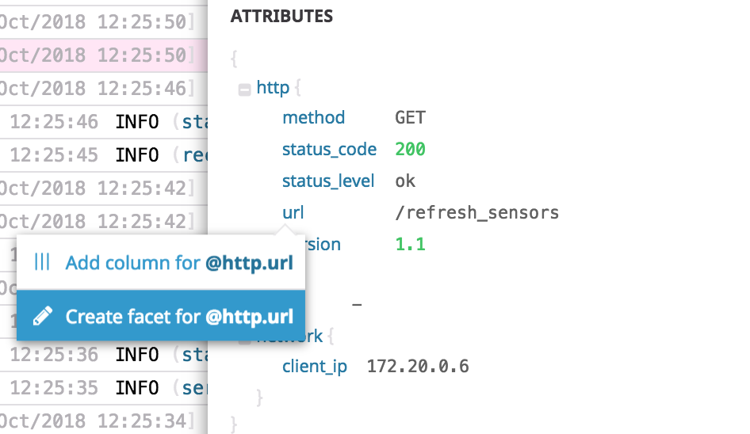

Don't forget to assign a group to your facet in order to avoid polluting your Log explorer view:

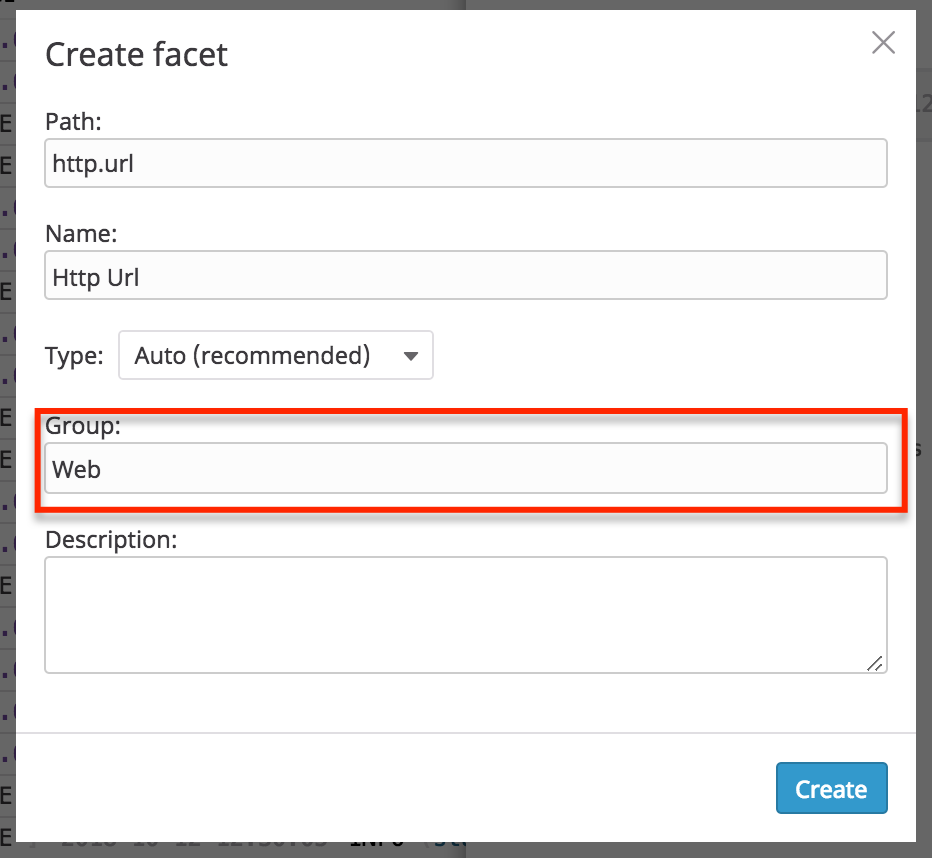

You can then use this facet to filter your log explorer view:

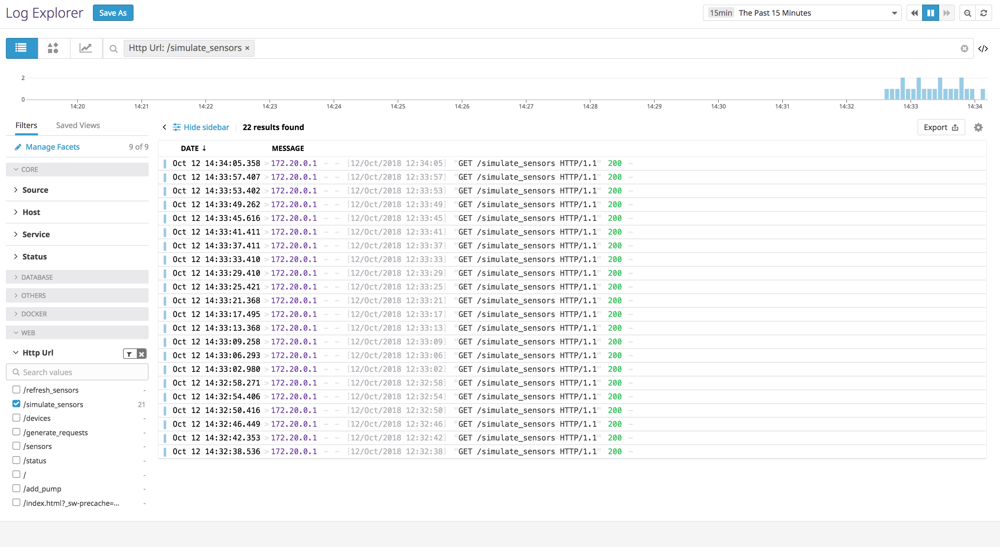

Or in your Log analytics:

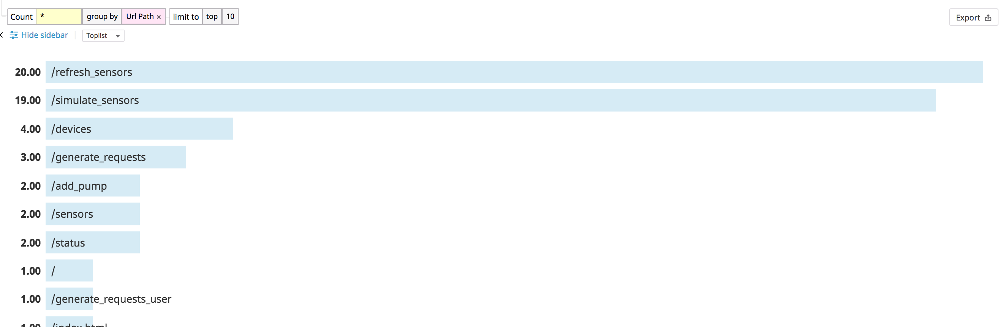


# Multi-line logs

Let's kill a container and see what happens: 

1. Check the list of running container with `docker ps`
2. Kill the conainter named `log-workshop-2_pumps` with `docker kill <CONTAINER_ID>`

When trying to add a new pump in the application, nothing should happen and Traceback should appear in the log explorer, but they are not parsed well and the `\n` inside of them is messing with the log wrapping: 


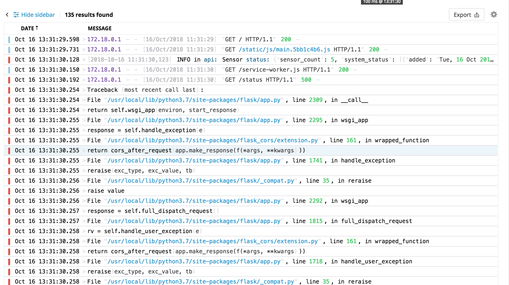

To compensate for this two options are available:

1. Log in JSON format in order to always have the Stacktrace properly wrapped (Recommended)
2. Update the container label in order to specify to the Datadog Agent the pattern for a new log.

Let's update the label with the following rule:

```
  frontend:
    (...) 
    labels:
      com.datadoghq.ad.logs: '[{"source": "iot-frontend", "service": "iot-frontend", "log_processing_rules": [{"type": "multi_line", "name": "log_start_with_ip", "pattern" : "(172.20.0.1|Traceback)"}]}]'
```

Then restart your application:

1. Run `docker-compose stop && docker-compose rm`
2. Run `POSTGRES_USER=postgres POSTGRES_PASSWORD=123456 DD_API_KEY=<DD_API_KEY> docker-compose up`

Stacktraces from the `iot-frontend` service are now properly wrapped in the Log explorer view:

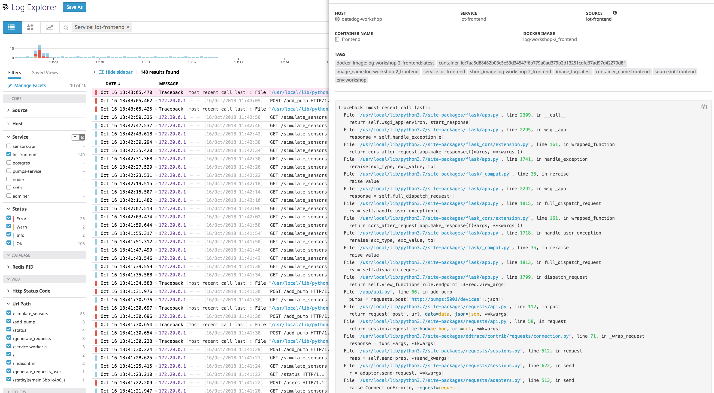

# Monitoring your logs

Let's build a monitor upon our logs that warns us if an error occures and that send us the corresponding logs:


1. Enter the search you want to monitor logs from in your Log explorer search bar:

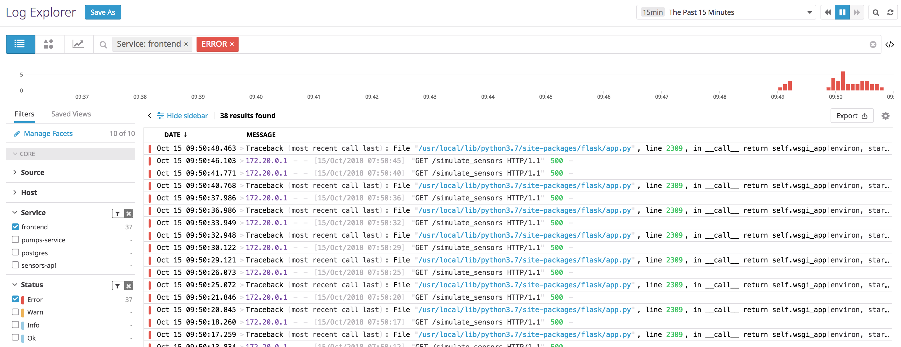

2. Click on the export to monitor button in the uper right corner of the Log explorer page:
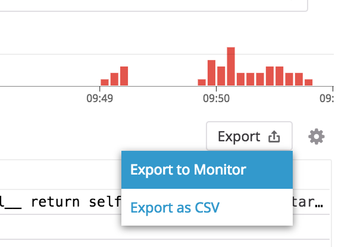

3. Set up a Warning and Alert threshold for your Log monitor

4. Set the monitor title and template the notification sent.

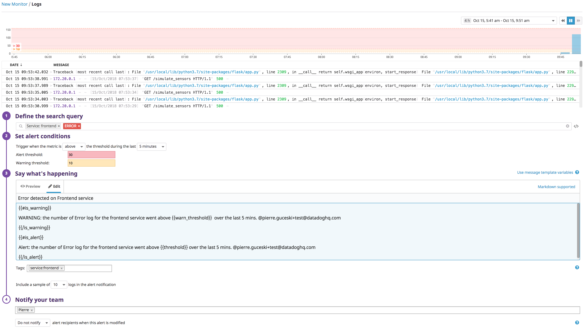

5. Save your monitor.

6. Check that your monitor is correctly saved in your manage monitor page.

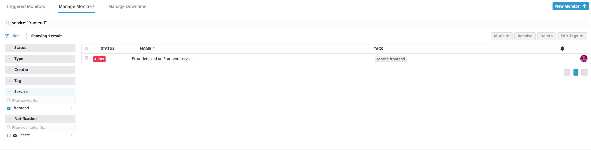

### Monitor notification

If you entered your email adress in the notification you should receive an email with a snippet of 10 logs matching your query:

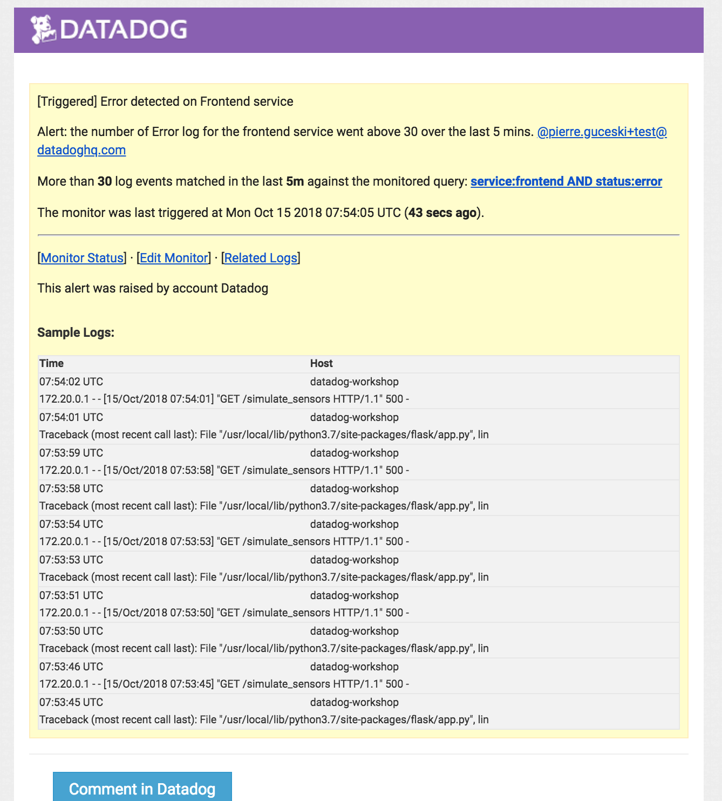